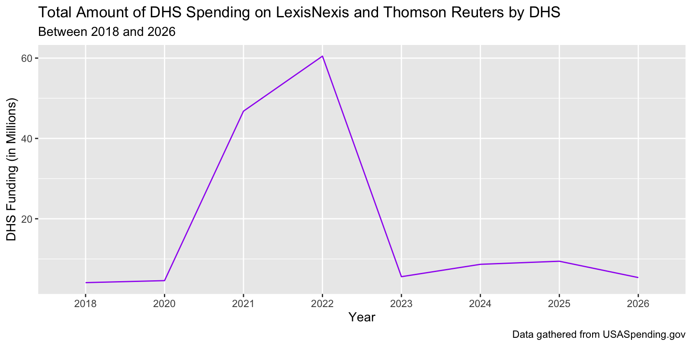

# Ethical Crisis in Law Librarianship: Legal Databases and Government Surveillance

## By Iman Shah

### Introduction

Law librarianship faces an ethical crisis with the predominance of Westlaw and LexisNexis as the two predominant commercial legal research databases. These two entities simultaneously conduct mass surveillance, engage in data brokering, and facilitate state violence. Still, every accredited law school, law library, and most law firms have vendor relationships with at least one of these databases. How do we reconcile our relationship to these companies with their practices of data brokering and providing the U.S. Department of Homeland Security with tools and information to facilitate unethical surveillance and deportations?

It is important for law librarians, lawyers, and other consumers to understand the scope of how involved these legal research companies are with federal and state law enforcement and border patrol. Helpfully, in 2014, Congress passed the Digital Accountability and Transparency Act (DATA Act), which established unified reporting standards that the federal government must adhere to about publishing financial data across agencies. Using the award data compiled through the DATA Act, I created visualizations that illustrate the financial relationship between the Department of Homeland Security and Westlaw and LexisNexis. By concretely identifying where funds are going, we can continue pushing back against being complicit in tools that harm marginalized communities the most.

### Dataset

My data is found through the government’s USA Spending page, collected by the U.S. government as part of public reporting requirements for government spendings and agency awards. There is a 90-day delay in publicly displaying contract award data, but all government contracts should be uploaded and documented by the federal government and uploaded into their database. The USA Spending data allows for the user to easily filter by the government agency. Here, the focus was awards and contracts formed between private entities and the U.S. Department of Homeland Security, under which the subagency of Immigration and Customs Enforcement is housed. I obtained data from the years 2018 to 2026, inclusive of all the subagencies under the Department of Homeland Security.

### Ethical Concerns and Limitations

The federal government agencies reporting this data have likely cleaned and represented the information in the broadest way allowed by the DATA Act. The information itself does not reveal specifics about exactly what services companies are providing to the U.S. government and speaks more to the general themes. Further, the companies listed in the data as being awarded government contracts may have associations or affiliations not explained by the data itself, so the user must do an extra step in researching what those may be.  

As official and publicly reported data that implicates the behavior and spending of the federal government, there are not glaring ethical issues with using this data. The federal government should rightfully have obligations to transparently publish this information, and we should know how our money is being used and weaponized against marginalized communities.

### Findings and Results

In organizing and sorting the data, I wanted to focus specifically on contracts implicating Westlaw and LexisNexis or their parent companies, Thomson Reuters and RELX. To achieve this, I filtered for recipient names where the string included references to Thomson, West Publishing, Lexis, or RELX. Then, I was able to create a new column based on the contracts’ period of the performance start date and arrange that data by year. Finally, I summarized the contract data by calculating the total award amount grouped by the year. 

| Year     | Total Contract Awards |
|----------|-----------------------|
| 2018     | $4,106,461            |
| 2020     | $4,607,997            |
| 2021     | $46,791,073           |
| 2022     | $60,485,126           |
| 2023     | $5,588,166            |
| 2024     | $8,668,113            |
| 2025     | $9,434,669            |
| 2026     | $5,367,963            |

Through my data analysis, I learned that the Department of Homeland Security has spent at least a total of $145,049,568 on contracts with RELX and Thomson Reuters between the years 2018 to 2026. 

First, when considering the total spending by year, we can see that the highest amount of spending took place in 2022, when the Department of Homeland Security formed contracts totaling over $60 million with these two major data companies. The year prior, the agency had spent $46 million, which was a drastic increase from 2020’s spending of $4.6 million. After 2022, the amount of new spending dropped off significantly, with the most recent spending from the first three months of 2026 totaling $5,367,963. However, one noteworthy explanation for why 2021 and 2022 seem disproportionately high is because these contracts have multi-year periods. Some of the contracts formed in 2021 and 2022 were not set to expire until 2025 or beyond, so this can explain why the government did not need to form brand new contracts to continue receiving the same services. 

<iframe src="plot_2.html" width="800px" height="800px"></iframe>

Second, when visualizing the data by the specific entity, we can see that LexisNexis contracted for the highest value award with the Department of Homeland Security in 2021, amounting to $22.1 million for what was described as “a law enforcement investigative database subscription.” Through this data, we also see that LexisNexis and RELX have consistently been awarded higher contracts than Thomson Reuters or West Publishing from 2020-2026. 

<iframe src="plot_3.html" width="800px" height="800px"></iframe>

Third, while most people commonly associate the Department of Homeland Security with Immigration and Customs Enforcement, the overall Department also houses numerous other subagencies that are also involved with surveillance and policing. When we break down the spending by the subagencies on these databases between 2018-2026, we see that multiple subagencies are investing in surveillance tools. This includes U.S. Customs and Border Protection and the U.S. Coast Guard in 2020, the Transportation Security Administration and U.S. Secret Service in 2021, U.S. Citizenship and Immigration Services and the Federal Emergency Management Agency in 2023, Federal Law Enforcement Training Center and Office of the Inspector General in 2024, and the Office of Intelligence and Analysis and Cybersecurity and Infrastructure Security Agency in 2025.

### Conclusion

Overall, this data helps us understand just how wide of a net the U.S. federal government casts to collect data on every individual residing within its borders, all without the need to obtain a warrant or congressional oversight. Multiple subagencies within the Department of Homeland Security contract specifically with Thomson Reuters and LexisNexis for access to their databases and digital infrastructure, for a total of over $145 million from 2018 to the present. Although there was a distinct peak in spending between 2021 and 2022, the Department of Homeland Security has continued forming multi-million-dollar contracts with these companies or reaping the advantages of contracts that exist across a span of five years or more. Interestingly, LexisNexis and its parent company RELX have received more federal investment than Thomson Reuters/West Publishing, which could indicate where our efforts pushing back against these practices are most effectively spent. 

Law librarians are caught in a difficult position where they rely on commercial legal database tools for our research and instruction, and to meet our professional standards. However, Westlaw and LexisNexis’ corporate practices are destructive and harmful to our communities, particularly immigrants and people of color. As a community, academic law librarians can engage in practical strategies such as limiting vendor presence on campus, teaching alternatives to mainstream commercial research platforms, and contributing to organizing efforts to put pressure on legal research companies to discontinue harmful practices. Hopefully this data analysis helps law librarians identify the scale of the damage being done, and illustrates where the most effective pressure points for organizing and pushing back are. 
